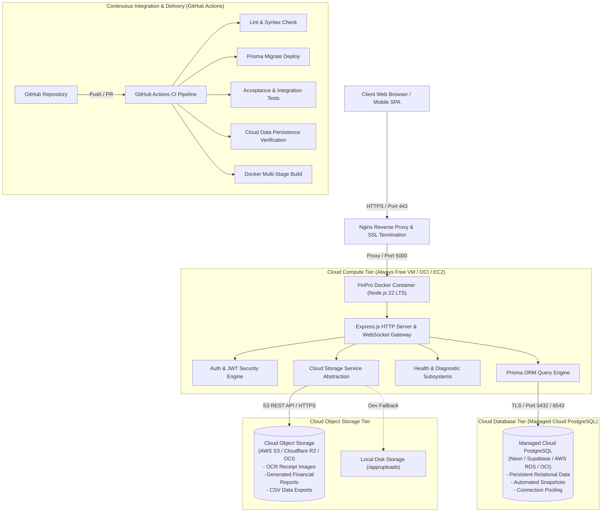

# FinPro — Cloud Computing Architecture

## 1. Executive Architectural Overview

FinPro is engineered as a **Cloud-Ready, Three-Tier Personal Financial Decision Support Platform** adhering to production cloud computing best practices. The architecture decouples application compute, persistent relational data storage, and object storage, providing scalability, reliability, and security without unnecessary complexity.



---

## 2. Core Architectural Tiers

### A. Cloud Compute Tier (Containerized Application)
- **Host**: Linux Virtual Machine (Oracle Cloud Infrastructure Always Free Compute instance: Ampere A1 or AMD E2.1.Micro / Ubuntu 24.04 LTS).
- **Runtime**: Docker multi-stage container executing Node.js 22 LTS Alpine.
- **Security**: Non-root user (`node`) execution, read-only file systems where feasible, isolated `/app/uploads` volume.
- **Reverse Proxy**: Nginx handling SSL/TLS termination, HTTP/2 multiplexing, Gzip compression, and rate limiting.

### B. Persistent Cloud Database Tier
- **Engine**: Managed PostgreSQL 15/16/17 (e.g., Neon Serverless, Supabase, AWS RDS, or OCI Managed Database).
- **Driver / ORM**: Prisma ORM with connection pooling support (`pgbouncer=true` or Prisma native pooler).
- **Security**: Strict TLS/SSL encryption in transit (`sslmode=require`), zero public exposure of database ports on the host machine.
- **Schema Management**: Strictly version-controlled migrations executed via `npx prisma migrate deploy`.

### C. Cloud Object Storage Abstraction Tier
- **Service**: `storageService` abstraction supporting both Local Disk (development sandbox) and S3-Compatible Cloud Object Stores (production).
- **Use Cases**:
  - Raw OCR receipt image uploads
  - Generated monthly and annual financial PDF/CSV reports
  - User document proofs and statement backups
- **Operations**: `upload`, `download`, `delete`, `getPublicOrSignedUrl`, and `checkStorageHealth`.

### D. Observability & Health Monitoring Tier
- **Probes**:
  - `GET /api/v1/health`: High-level system vitals.
  - `GET /api/v1/health/database`: Live `SELECT 1` execution with latency measurement.
  - `GET /api/v1/health/storage`: Read/write verification of active storage provider.
  - `GET /api/v1/health/ready`: Orchestrator readiness probe (K8s/Docker/Nginx).
- **Status Dashboard**: `/status.html` rendering real-time, measured metrics for academic evaluation.

---

## 3. High-Level Data Flow

```
1. User Request (HTTPS) 
   ──> Nginx (Reverse Proxy) 
   ──> Express.js Middleware (Helmet, CORS, RateLimit, RequestLogger)
   ──> JWT Authentication Middleware
   ──> Business Logic Controller (e.g. Transactions, Receipts, Budgets)
       ├──> Prisma ORM (Encrypted TLS) ──> Cloud PostgreSQL
       └──> StorageService (REST API)  ──> Cloud Object Storage (S3 / R2)
   <── JSON Response / Direct Stream
```
