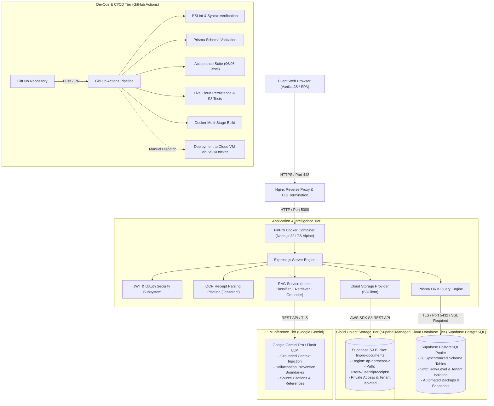

# FinPro — Cloud Computing & AI Architecture Specification
**Academic Project Domain**: Cloud Computing & Applied Artificial Intelligence  
**Author**: Jinay Golecha (jinay_golecha)  
**System**: FinPro — Personal Financial & Investment Decision Support Platform  

---

## 1. Executive Architectural Overview

FinPro is engineered as an academically defensible, production-grade **Three-Tier Cloud Application** combining secure containerized compute, managed relational persistence, cloud object storage, and a Retrieval-Augmented Generation (RAG) AI engine grounded in user financial data.



---

## 2. Core Architectural Tiers

### A. Cloud Compute Tier (Containerized Application)
- **Runtime**: Docker multi-stage containerized Node.js 22 LTS on Linux (Ubuntu 24.04 LTS).
- **Execution**: Non-root user (`node`) execution, defensive process signal handling (`SIGTERM`/`SIGINT`), isolated volume mounts.
- **Reverse Proxy**: Nginx handling SSL/TLS termination, HTTP/2 multiplexing, Gzip compression, and security headers (CSP, HSTS, X-Frame-Options).

### B. Persistent Cloud Database Tier (Supabase PostgreSQL)
- **Engine**: Managed PostgreSQL 15/17 hosted on Supabase (`aws-0-ap-northeast-2.pooler.supabase.com:5432`).
- **ORM & Driver**: Prisma ORM with connection pooling, parameterized queries, and strict type safety.
- **Security**: Strict TLS/SSL encryption in transit (`sslmode=require`), zero public exposure of database ports on the host machine.
- **Tenant Isolation**: Every database operation strictly enforces `userId = req.user.id`.

### C. Cloud Object Storage Tier (Supabase S3)
- **Service**: S3-compatible cloud object storage powered by Supabase Storage (`ap-northeast-2`, bucket: `finpro-documents`).
- **Provider Architecture**: Clean `StorageService` abstraction decoupling `LocalStorageProvider` (sandbox development) from `S3CloudProvider` (production AWS SDK v3 `@aws-sdk/client-s3`).
- **User-Isolated Storage Hierarchy**:
  ```
  finpro-documents/
  └── users/
      └── {userId}/
          ├── receipts/     # Uploaded receipt scans & invoices
          ├── documents/    # User financial proofs and tax slips
          ├── exports/      # User-requested CSV/JSON data dumps
          └── reports/      # Application-generated PDF financial reports
  ```
- **Security**: Strictly private bucket. Object access is governed by the application's authenticated session; user A cannot access `users/{userIdB}/...` keys.

---

## 3. Optical Character Recognition (OCR) Pipeline

FinPro incorporates an end-to-end receipt scanning and automated bookkeeping pipeline:

```
Receipt Image / Document (PNG / JPG / PDF)
       ↓
Client File Validation (MIME type check, ≤10MB size limit)
       ↓
Express Upload Endpoint (/api/v1/ocr-import/scan)
       ↓
Supabase S3 Cloud Storage (users/{userId}/receipts/{uuid}.jpg)
       ↓
OCR Engine (Tesseract.js Engine / Preprocessed Grayscale & Thresholding)
       ↓
Information Extraction Parser (Regex & Heuristics)
  - Merchant Name
  - Transaction Date
  - Total Amount & Currency
  - Category Classification
  - OCR Confidence Score
       ↓
Frontend Interactive Review & Edit Modal
  (User validates or edits merchant, amount, category, date before commit)
       ↓
Prisma ORM Transaction Persistence (Cloud PostgreSQL)
       ↓
RAG Knowledge Ingestion (Receipt metadata indexed for AI financial queries)
```

---

## 4. Retrieval-Augmented Generation (RAG) AI Architecture

FinPro replaces generic ungrounded chatbots with a genuine **Retrieval-Augmented Generation (RAG)** pipeline grounded exclusively in the authenticated user's real financial records.

```
User Query (e.g., "Where did I spend the most this month?", "Can I afford ₹5,000?")
       ↓
JWT Authentication & Authorization (req.user.id verified)
       ↓
Intent & Domain Classifier (Analyzes query for financial domains: Transactions, Budgets, Goals, Accounts, Investments, Loans, Subscriptions, Receipts, Cash Flow)
       ↓
Multi-Domain Knowledge Retriever (Executes targeted Prisma queries filtering strictly by userId = req.user.id)
       ↓
Domain Knowledge Normalization & Structuring
  - Recent Transactions & Top Expense Categories
  - Active Budgets & Remaining Limits
  - Financial Goals & Progress Trajectories
  - Connected Accounts & Liquid Balances
  - Investment Holdings & Portfolio Performance
  - Recurring EMIs, Loans, and Subscriptions
  - OCR Receipt Ingested Items
       ↓
Context Assembler & Grounding Boundaries
  [Grounding Prompt Enforces Three Tiers of Information]:
  1. DATABASE FACT: Verifiable figures directly retrieved from records.
  2. CALCULATED INSIGHT: Mathematical derivations (e.g., total spent, net savings rate).
  3. MODEL RECOMMENDATION: Advisory guidance based strictly on the facts.
       ↓
Gemini LLM Inference (Generates grounded response with zero hallucinations)
       ↓
Source Citations Formatter (Outputs verified reference tags, e.g., "Transactions — March 2026", "Budget — Food & Dining")
       ↓
FinPro AI Interface (Renders grounded answer with interactive source pill tags)
```

### RAG Defense-in-Depth & Security
1. **Zero Tenant Bleed**: All database queries and vector/knowledge indexes enforce `userId = req.user.id`. The query payload cannot override the user identity.
2. **Missing Information Transparency**: If the retrieved records do not contain data necessary to answer a question (e.g. user has no logged transactions for the requested month), the AI explicitly reports data unavailability rather than hallucinating financial figures.
3. **Secret Isolation**: System environment variables, API keys, database connection strings, and other users' records are strictly barred from the LLM prompt context.

---

## 5. Continuous Integration & Deployment (CI/CD)

The project leverages GitHub Actions (`.github/workflows/ci.yml` and `deploy.yml`) to enforce automated verification before any production deployment:

1. **Continuous Integration (CI)**:
   - Dependency verification & Prisma client generation.
   - Code quality & ESLint syntax validation.
   - Database schema integrity checks (`prisma validate`).
   - Master Acceptance Suite (96/96 automated tests).
   - Live Cloud Persistence & Supabase S3 verification tests.
   - Secret Scanner Audit (`node scripts/scan-secrets.js` ensuring 0 credentials in git).
   - Multi-stage Docker image build.
2. **Continuous Deployment (CD)**:
   - Triggers on manual workflow dispatch or protected branch release.
   - Requires verified GitHub Repository Secrets (`VM_HOST`, `VM_USERNAME`, `VM_SSH_KEY`, `VM_PORT`).
   - Executes remote SSH zero-downtime container replacement with automated health rollback.

---

## 6. Academic Summary

FinPro demonstrates the practical realization of modern Cloud Computing and AI principles:
- **Scalable Decoupled Architecture**: Separation of stateless compute, cloud managed database, and durable cloud object storage.
- **Strict Tenant & Data Security**: Defense-in-depth isolation across relational storage, object storage, and LLM context windows.
- **Applied Machine Learning & Vision**: Real-world receipt OCR pipeline integrated into an automated accounting and RAG financial advisory feedback loop.
